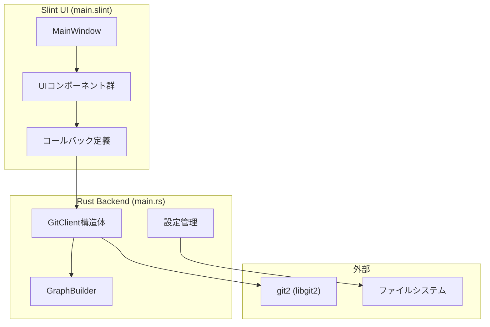

# 開発者ガイド

RustGitGUIの開発に参加するための情報をまとめています。

## 技術スタック

| 技術 | バージョン | 用途 |
|------|-----------|------|
| Slint | 1.14 | UI フレームワーク |
| git2 | 0.20 | Git操作（libgit2バインディング） |
| chrono | 0.4 | 日時処理 |
| dirs | 6.0 | 設定ファイルパス取得 |
| rfd | 0.16 | ファイルダイアログ |
| arboard | 3.6 | クリップボード操作 |
| open | 5.3 | 外部URLを開く |

## プロジェクト構成

```
git-client/
├── Cargo.toml          # 依存関係定義
├── build.rs            # Slintビルドスクリプト
├── README.md           # 利用者向けドキュメント
├── src/
│   └── main.rs         # Rustバックエンド（3400行）
├── ui/
│   └── main.slint      # Slint UI定義（1680行）
└── docs/
    ├── DEVELOPMENT.md  # このファイル
    └── FEATURES.md     # 機能一覧
```

## アーキテクチャ



## 主要コンポーネント

### GitClient (`src/main.rs`)

git2をラップしたGit操作クラス。主なメソッド：

| メソッド | 説明 |
|---------|------|
| `open_repo()` | リポジトリを開く |
| `get_commits_with_graph()` | コミット履歴とグラフデータ取得 |
| `get_status()` | Staged/Unstagedファイル取得 |
| `stage_file()` / `unstage_file()` | ファイルのステージング |
| `commit()` | コミット作成 |
| `push()` / `pull()` | リモート操作 |
| `checkout_branch()` | ブランチ切り替え |
| `merge_branch()` | ブランチマージ |
| `stash_save()` / `stash_pop()` | Stash操作 |

### GraphBuilder (`src/main.rs`)

VSCode Git Graph風のコミットグラフ描画エンジン。

- コミットの親子関係からブランチ線を計算
- 色分け（16色パレット）
- SVGパス生成（Slintの`Path`要素で描画）

### UIコンポーネント (`ui/main.slint`)

| コンポーネント | 説明 |
|---------------|------|
| `MainWindow` | メインウィンドウ |
| `GraphCommitItem` | コミット行（グラフ＋情報） |
| `FileItem` | ファイル項目（Stage/Unstage用） |
| `DiffLine` | Diff行 |
| `LocalBranchItem` / `RemoteBranchItem` | ブランチ項目 |
| `StashItem` | Stash項目 |
| `ModalLineEdit` / `ModalButton` | モーダル用入力・ボタン |

## ビルド方法

```bash
# デバッグビルド
cargo build

# リリースビルド
cargo build --release

# 実行
cargo run
```

## 設定ファイル

設定は `~/.config/slint-git-client/` に保存されます：

- `recent_repos.json` - 最近使用したリポジトリ一覧
- `commit_history.json` - コミットメッセージ履歴

## コード規約

### Rust (main.rs)

- `GitClient`のメソッドは`Result<(), String>`を返す
- エラーメッセージは日本語でも英語でもOK
- コールバックは`main()`関数内で`on_`プレフィックスで登録

### Slint (main.slint)

- `callback` → Rustから呼ばれる
- `in-out property` → UIとRustで双方向バインディング
- コンポーネント名はPascalCase

## クリップボード操作の注意点

Linux環境ではクリップボード操作に特殊な対応が必要：

```rust
#[cfg(target_os = "linux")]
fn copy_to_clipboard_async(text: String) {
    std::thread::spawn(move || {
        if let Ok(mut clipboard) = Clipboard::new() {
            let _ = clipboard.set().wait().text(text);
        }
    });
}
```

`.wait()` を使用しないとクリップボードマネージャーにデータが渡る前にスレッドが終了します。
